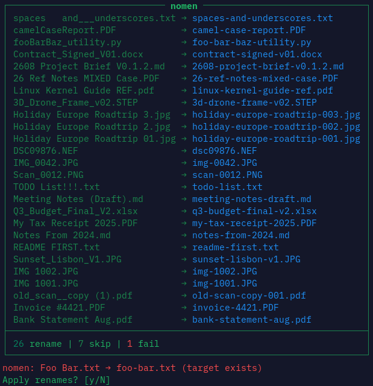

# nomen

A no-deps bash file renamer following the **Single-End** software philosophy. Normalizes filenames to a fixed nomenclature. Form only; it will not invent a better name.

NOMEN has no settings and no flags. For configuration, edit the installed script (`~/.local/bin/nomen`, or `/usr/local/bin/nomen` if system-wide), or edit it yourself (see Philosophy below).

See [examples.md](examples.md) for other nomenclature shapes. Run `./demo.sh` for a demonstration.



Default grammar: `[date-]term(-term)*[-vN|NNN].ext`  
Date optional (`YY` / `YYMM` / `YYMMDD`). Version and batch suffixes are automatically normalized.

## The Single-End Philosophy

**Software that serves a single end;** only what *you* require, and little else. This philosophy is intended for very small programs in a world of token abundance.

- Settings are bloat. Just change the code.
- Different user, different code. Ends are bespoke.
- Few lines of code keep the program pliable, cheap in tokens, and gratifying.

## Install

```bash
curl -fsSL https://raw.githubusercontent.com/Comninos/nomen/master/install.sh | bash
```

System-wide: `… | sudo bash -s -- --system`  
From clone: `./install.sh`

```bash
nomen .
nomen ./inbox ./scan.pdf
```

## For Agents

- Drop unused normalize rules when changing the grammar.
- Keep the shape: small script, no config, no flag farm, few deps.
- Prefer editing constants and functions over adding switches.

## License

[MIT](LICENSE)
